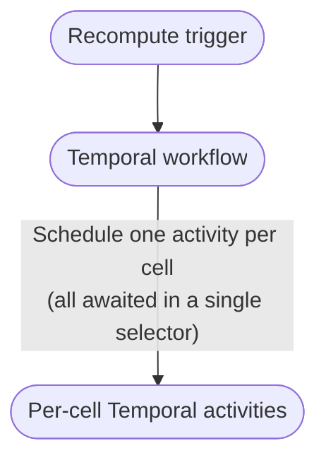
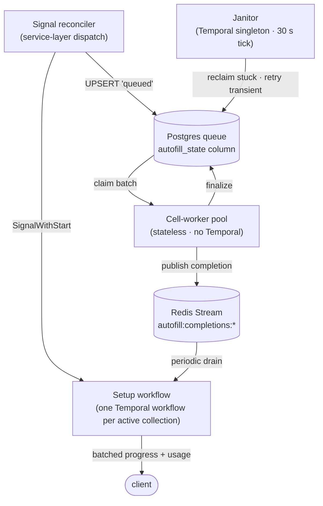
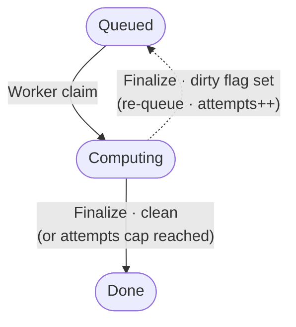

Imagine a spreadsheet where any cell can be AI-computed: a URL column, an AI-generated summary that depends on it, an AI-generated sentiment that
depends on the summary. Edit one URL, and a small DAG of cells recomputes. Now imagine you have ten million such cells, and a single user just clicked
_Reprocess column_.

That's the design problem behind **Collection Autofill** — a feature in Instill AI that lets users define AI-computed cells and watch them recompute
automatically. This post is a walkthrough of how it works at scale: the contract we promise users, the architecture that makes it true, the handful of
design calls that ended up doing most of the work, and why we leaned on Temporal, Postgres, and Redis instead of the alternatives.

## A note on Collections

A bit of product context first. **Collections** are the core pillar of Instill AI — the surface where unstructured data becomes _structured context_.
The inputs aren't only static uploads (documents, images, videos, audio): they include **dynamic sources** too — a web URL the system fetches and
re-fetches, an RSS feed, a connector pulling rows from another system. Each input becomes a row; AI-generated columns extract, summarise, classify, or
otherwise derive each row into queryable fields. A folder of contracts becomes a table you can filter by counterparty, expiry, and risk; a list of
competitor URLs becomes a market-watch sheet that re-grades when pages change; a library of meeting recordings becomes a table you can search by topic
and decision; a research corpus — files, links, and live feeds intermixed — becomes a knowledge base your downstream agents can reason over. A
Collection is what turns "a folder of stuff and a stack of links" into "a database I can ask questions of".

So the Collection product concept rests on four pillars:

- **Structured context** — Collections turn files, URLs, live feeds, recordings, and other unstructured inputs into queryable fields.
- **Static and dynamic sources** — inputs can be uploaded once, fetched repeatedly, or synced from another system as rows change.
- **Column-defined workflow DAG** — AI-generated columns can depend on other columns, so the table schema itself defines the recomputation graph.
- **Human and agent interoperability** — users can inspect, correct, override, and monitor the data, while agents rely on the same structured state
  for reasoning and downstream actions. The two views must stay connected and observable instead of becoming separate systems.

Autofill is the engine that fills those AI-computed cells, regardless of whether the input was a static file or a live URL. It's the bridge between
_whatever raw context you pointed the system at_ and _the structured context the system surfaces_ — which means it has to be fast, fair, and
observable at any scale a real user might throw at it.

That makes Autofill's execution design rest on a different set of pillars: transactional queue correctness, bounded durable orchestration, stateless
and idempotent cell compute, fairness and isolation, latest-write safety, and separate scaling axes for setup orchestration and cell computation.

## What we're actually building

A Collection in Instill AI is a tabular structure (i.e., spreadsheet) with one twist: columns can define computation, not just storage. Any column can
be configured as **AI-computed**, and AI-computed columns can depend on other columns. That column dependency graph is the workflow DAG Autofill has to
execute. Edit a URL in column A and column B's AI summary recomputes. Mark column C's sentiment as depending on B's summary, and editing the URL fans
out: A → B → C. Multiply by ten thousand rows and the schema-level DAG becomes a large cell-level recomputation graph.

The contract is deceptively simple to describe and quite hard to implement well. Each AI cell carries two values — what _you_ typed and what the _AI_
produced; user input always wins for display. The system has to handle: per-collection fairness so one big reprocess can't starve everyone else,
per-namespace in-flight caps so one tenant can't monopolize the worker pool, latest-write safety under overlapping recomputes, schedule modes (compute
on change, never, or on a cron), file inputs that arrive asynchronously, and a UI that wants live progress updates. That's the bar.

## Why a naïve Temporal-only design doesn't scale

The natural first attempt is to put everything in Temporal: one workflow per row, per-cell **activities** awaited inside the workflow's selector.
Conceptually clean — one workflow per scope, an activity record for each cell, durable execution end to end. It's the design any engineer with
Temporal experience would prototype first.

It works beautifully at the demo scale of a hundred rows. Above 50,000 cells, four things compound.

**1. The selector loop becomes single-threaded.** Every per-cell future is awaited inside one workflow's selector. Temporal's selector is fast, but it
processes futures one at a time. At a million cells, scheduling overhead alone consumes roughly a hundred seconds _before the first LLM token comes
back_. The workflow looks busy; nothing observable is happening.

**2. Temporal history grows linearly with cells.** Each per-cell activity writes two history events; a million-cell run produces two million. That's
well past Temporal's 10,240-event soft warning (the threshold at which it nudges you to call Continue-As-New) and on track for its 51,200-event hard
cap, where the server terminates the workflow. There's a parallel 50 MB total-history-blob limit too.

**3. There is no per-collection fairness.** One greedy bulk reprocess on collection A consumes every available LLM-queue slot in the cluster — a user
editing a single cell on collection B waits until A's bulk run finishes, sometimes hours later. The dispatch loop has no notion of "this is a
different tenant; let it cut the line".

**4. Setup and cell-compute deploy together.** Both live in one binary, but they change at very different cadences: prompts and tool wrappers get
tweaked several times a week; the workflow lifecycle (shared-cache build, completion-aggregation tick) is touched once a quarter. Coupled deploys mean
every prompt change is also an orchestration restart — dropping in-flight cache leases and blinking SSE streams. They scale differently too —
cell-compute by LLM throughput, orchestration by active-collection count — but the shared binary forces one shape onto both.

The first two are about Temporal being asked to do the wrong job. It's a brilliant tool for orchestrating workflows with bounded numbers of events —
for processes that need durable state, retries, signals, and human-readable history. **It is not a queue.** The moment you write
`for cell in 1..N { schedule activity }`, you've built a queue on top of Temporal's history mechanism, and you'll pay for it twice — once in
scheduling overhead, once in storage. The third and fourth aren't Temporal's fault; they follow from putting cell-level scheduling and per-collection
orchestration in the same place.

## The architecture

Sit with the constraints and they suggest their own answer.

- Cell-level work is **stateless and idempotent**. Workers just need to claim a cell, run an LLM call, write the result. If a worker dies, another
  picks it up. That's a queue, not a workflow.
- Per-collection orchestration **is** a workflow. Building a shared cache (DAG, credit check, namespace), aggregating completions, emitting batched
  progress events, recording usage — all of that benefits from durable execution and bounded history.
- The two have **different deploy cadences**. They should be separate binaries.

So Collection Autofill has three components and one singleton, separated along exactly those seams.

In one sentence each:

- **Signal reconciler** — a service-layer dispatch primitive every trigger surface goes through. It atomically queues cells in Postgres and signals
  the per-collection workflow.
- **Setup workflow** — exactly one Temporal workflow per active collection. Owns the bounded orchestration: shared cache, completion aggregation,
  progress emission, usage recording. Calls Continue-As-New on idle, so its history never grows linearly with cell count.
- **Cell-worker pool** — stateless pods, no Temporal client. Each worker grabs the next un-claimed work item from the Postgres queue using
  `SELECT FOR UPDATE SKIP LOCKED` (a Postgres pattern where many workers race for rows without blocking each other — locked rows are silently skipped
  instead of queued behind), runs the LLM call, and writes the result back with a guard that commits only if no one else has touched the cell since
  the claim (a compare-and-swap; a slow worker that got reclaimed can never overwrite a fresher one). Completion events go on a Redis Stream for the
  setup workflow to drain.
- **Janitor** — a Temporal singleton that reclaims stuck cells and retries transient failures on a 30-second tick. The platform enforces "exactly one"
  via the workflow ID; no per-pod leader election needed.

That's it for the topology.

## Three decisions that did most of the work

The shape above is the obvious half. The non-obvious half is three smaller decisions that paid for themselves daily.

### Separate state columns, not overloaded ones

The cell row carries **two state machines** in distinct columns:

- **Cell-status state** (user-visible): "is the AI's answer ready", "is it outdated", "is the spinner showing", "what failed", and the actual value.
  This is what the frontend reads.
- **Queue state** (worker-internal): an `idle / queued / computing / done / error` enum, a queued-at timestamp, a dirty flag for overlap handling.
  This is what the worker pool reads.

The two never share columns. Three repository methods (upsert, claim, finalize) are the only places that touch both, and each does so in one atomic
SQL statement with the sync rules baked in.

A naïve design overloads shared columns to mean different things at different lifecycle points. Half the race conditions in this kind of system live
in those overloads. Splitting the state spaces and gating the bridge through three atomic methods retires entire classes of bugs — without changing a
single line of frontend code. The user-visible contract is invariant; only the implementation underneath it changes.

If I had to name one decision I underestimated going in, this is it.

### Dirty flag over cancellation

What if a cell is mid-LLM-call and the user reprocesses it again? The naïve answer is "cancel the in-flight call and start over". That answer is wrong
twice over: you've already paid for the in-flight call (LLM tokens aren't refundable), and "cancellation that cleans up correctly" is a notorious
source of bugs.

The better answer is a dirty flag. When a new signal arrives for a cell already computing, we record a "fresher signal arrived" timestamp on the cell
and let the in-flight call finish. At finalize time, the worker checks: if a fresher signal came in since this attempt started, the queue state goes
back to `queued` after the attempt instead of settling as terminal. The next claim cycle picks it up; the user gets a fresh recompute. Cap the loop at
three rounds so a pathological signal storm can't burn money forever.

Dirty flags shift the guarantee from "cancel obsolete work" to "obsolete work cannot win". That is the right guarantee for LLM-backed cell
computation: retries, reclaims, and dirty requeues can run the work again, but the visible cell converges to the latest signal, and the
compare-and-swap guard prevents an old claim from overwriting a fresher one. Three states and three edges express the entire dirty-flag mechanic; the
rest of the state machine (cancel signals, janitor reclaim, transient retries) hangs off this same shape.

### Two binaries, decoupled

The deployment topology is the cheapest part of the design and pays back daily. Setup orchestration and cell computation run as separate binaries —
one with a Temporal client, one without — because they have fundamentally different roles, scaling characteristics, and resource profiles.

The **setup-worker** binary owns the per-collection setup workflow plus the cluster-wide janitor. Its job is coordination: build the shared cache
(DAG, namespace, credit lookup), drain the Redis-Stream completion bus, batch progress notifications to the frontend, record token usage, reclaim
stuck cells, retry transient failures. It scales modestly — bounded by the number of _active_ collections (a few dozen at any moment), not by the
number of cells — and carries the heavyweight initialisation for gRPC clients to Redis, the metrics pipeline, the storage layer, and the management
backend.

The **cell-worker** binary is a pure goroutine pool — twenty goroutines per pod by default — that runs a tight claim → LLM call → finalise loop. Each
goroutine atomically claims work from Postgres at the grain the queue shape calls for (cell, row, or batchable column), sends a gRPC request to the
Python LLM worker, writes the result back, and publishes a completion event. There's no Temporal client, no workflow registration, no task-queue
polling. Just a DB connection, an LLM-worker gRPC client, and a Redis publisher. Scaling is linear in cells-to-process: ten pods × twenty goroutines =
two hundred concurrent LLM calls.

Four reasons that decomposition matters:

**Independent scaling axes.** Cell-workers are CPU- and network-bound (waiting on LLM calls) and you want many of them — one per claimed work item in
flight. Setup-workers are IO-bound coordinators and one or two replicas suffice. In a single binary you'd either over-provision Temporal pollers when
scaling for LLM throughput, or under-provision cell-workers when scaling for collection count. Two binaries let each side scale to its own bottleneck.

**Failure isolation.** A cell-worker crash mid-LLM-call strands only the cells that pod claimed — they sit in _Computing_ until the janitor (in the
setup-worker) reclaims them. If both responsibilities lived in the same process, a crash would take out the worker _and_ its own recovery mechanism in
one stroke.

**Different restart semantics.** The setup-worker leans on Temporal's durable execution — workflows survive restarts via event replay. The cell-worker
is stateless and disposable: kill it, restart it, scale it to zero, and the Postgres state machine is the only thing that matters. Mixing
workflow-style replay with a stateless goroutine pool in one binary complicates shutdown ordering and graceful drain.

**Different resource profiles.** Cell-workers are network-bound and need many goroutines; setup-workers are memory-bound (workflow replay history) and
need a high concurrent-workflow-task ceiling but few goroutines. Different tuning, different pod resource requests, different
horizontal-pod-autoscaler thresholds. One binary means one shape — and you'd tune it for the louder of the two concerns at the cost of the other.

Two operational concerns; two binaries.

## Why Temporal, Postgres, and Redis — and not the alternatives

A reasonable reader will ask: did you really need three pieces of infrastructure? Couldn't a single workflow engine, message bus, or stream-processing
framework have done it all? Three short answers, one per layer.

**Temporal earns its keep as the orchestration tier** because the setup workflow needs durable state, signals, and Continue-As-New: it has to survive
deploys, coalesce overlapping triggers, hold a 5-minute Redis cache lease, and emit batched progress ticks for as long as a collection is active. That
is a workflow, not a job. A DAG scheduler like _Airflow_ assumes batch runs on a calendar; a task queue like _Celery_ has no first-class signals or
durable workflow state. Temporal is exactly the right shape — the rebuild's lesson is only that it's the _wrong_ shape for the cell-dispatch tier
inside it.

**Postgres earns its keep as the queue tier** for one decisive reason: the queue state and the cell value need to be **transactionally consistent**.
When a worker finalizes a cell, "the queue says this work is done" and "the cell row shows the AI result" must succeed or fail together. With Postgres
that's one transaction; with a separate queue product like _Kafka_, _NATS_, or _SQS_ it's two systems and a distributed-commit problem, plus a
separate rate-limiter to recover the fairness that a SQL window function gives us directly (cap each collection, and optionally each namespace, to N
in-flight claims). When your work items already live in a relational database and your retries are crash-safe, Postgres-as-queue is hard to beat.

**Redis earns its keep as the in-flight messaging bus** because the ask fits its shape exactly: small completion envelopes for the setup workflow,
ephemeral progress frames for the UI, and shared-cache invalidation markers between workers. _Kafka_ would be over-engineered (per-topic cost doesn't
amortise; we don't need long-lived analytical retention); _Pulsar_ or _NATS_ add a fourth stateful system to save twenty milliseconds. Redis was
already in the stack for shared cache; making it carry the bus cost nothing extra.

**One last cross-cutting alternative worth naming**: someone with a data-engineering background will reasonably ask whether this should have been a
_Flink_ or _Kafka Streams_ job — events in, events out. The answer is no for three reasons. The workload is bursty rather than continuously streaming;
the cells are independent transforms with no windows or joins; and a stream processor's checkpoint-and-state-backend overhead is enormous relative to
"claim a row, finalize a row". Stream processors are the right answer for real-time aggregations, multi-stream joins, time-windowed metrics. They are
not the right answer for a per-cell idempotent LLM transform fed by a queue.

The temptation in any greenfield design is to reach for one shiny piece of infrastructure that solves _everything_. The discipline is to notice that
you have three layers with three different requirements — durable orchestration, transactional queue, transient messaging — and let each one pick its
tool independently.

## At scale

To sanity-check the 100K-10M-cell design target, I added a small in-process benchmark for the scheduling/state-machine layer. It allocates cell state,
runs concurrent claim/finalize workers, measures real CPU work, and models production CPU plus memory/storage footprint by component. The run below
used 200 workers, 16 collections, 4 namespaces, two Temporal events per cell, 512 durable bytes per Temporal event, 512 serialized payload bytes per
cell operation, 192 row bytes plus 96 index bytes per pool queue cell, and no dirty requeues. It is still not a claim that a production deployment
processed ten million live cells in one run.

<figure id="figure-1">
  
  <figcaption>Figure 1. In-process scheduling/state-machine simulation from 100K to 10M cells.</figcaption>
</figure>

The chart uses log-log axes, so a nearly straight line is expected for an **O(n)** workload. The useful signal is that both designs scale roughly
linearly with cell count in this simulation, while the worker-pool architecture has a lower constant factor and avoids the Temporal history event
growth that makes the naïve design operationally invalid long before ten million cells.

<figure id="figure-2">
  
  <figcaption>Figure 2. Modeled CPU units by architecture. Units are benchmark hash-iteration equivalents, not CPU seconds.</figcaption>
</figure>

<figure id="figure-3">
  
  <figcaption>Figure 3. Modeled production footprint by architecture, including app heap and durable orchestration or queue storage.</figcaption>
</figure>

|                                       | Naïve Temporal-only       | Collection Autofill                   |
| ------------------------------------- | ------------------------- | ------------------------------------- |
| 1M-cell simulator elapsed time        | ~ 3.41 s                  | ~ 1.41 s                              |
| 1M-cell simulator throughput          | ~ 293K cells/s            | ~ 708K cells/s                        |
| 1M modeled CPU units                  | ~ 1.19B                   | ~ 655M                                |
| 1M modeled app heap pressure          | ~ 153 MiB                 | ~ 13.3 MiB                            |
| 1M modeled total footprint            | ~ 1.13 GiB                | ~ 293 MiB                             |
| Temporal history events               | ~ 2,000,000 per run       | ≤ 10,000 per Continue-As-New window   |
| Per-cell Temporal activity records    | One per cell              | Zero                                  |
| Per-collection fairness               | None                      | Per-collection cap, SQL-enforced      |
| Per-namespace in-flight fairness      | In-memory, single-process | SQL-enforced when the cap is enabled  |
| Backpressure observability            | Indirect                  | One SQL query against the queue table |
| Setup vs cell-compute deploy coupling | One binary                | Two binaries, independently scalable  |

The user-facing contract is preserved end-to-end. Reset, Reprocess, Schedule modes, undo/redo, the spinner, the progress hover — all unchanged. The
frontend doesn't need to know any of the above exists.

## Where this design starts to bend (the 10B horizon)

The current architecture's design target is the 100K–10M-cell range per collection, with the bottleneck shifting from orchestration overhead to LLM
throughput, queue-claim contention, and completion aggregation. The next walls — partitioned column workflows for very wide columns, dedicated task
queues per collection, true batch LLM inference, per-cell version vectors so we don't recompute cells whose upstream values haven't changed,
hash-partitioning the cell table at very large scale — are all written down. None are urgent. All follow the same shape of question: at the next order
of magnitude, where does this design break first?

## Lessons

A few patterns worth tattooing on a younger version of the team.

**Use Temporal for what it's good at** — bounded orchestration with durable state, retries, signals, and human-readable history. Not millions of
events. The moment you find yourself writing `for x in 1..N { schedule activity }`, you've built a queue on top of a workflow engine and you'll pay
for it forever.

**Postgres is a perfectly good queue** for stateless retry-safe work. `SELECT FOR UPDATE SKIP LOCKED` plus window-function fairness caps gives you
per-collection and per-namespace budgeting in SQL — observable, queryable, indexed. It's been in Postgres since 9.5 and it's still the right answer
when your work items are idempotent.

**Separate state columns beat overloaded ones.** If two state machines live in the same row, give them two distinct sets of columns and gate the bridge
through a small number of atomic methods. The cost is a few extra columns; the payback is that nobody ever again has to reason about what a single
"started" timestamp means _here_ vs _there_.

**Dirty flags beat cancellation.** Cancelling expensive in-flight calls (LLM, external APIs, big queries) to honour a fresher signal wastes money and
adds bug-prone cleanup paths. A dirty flag plus a cheap re-queue gives latest-signal convergence with simpler code.

**Symmetric API surfaces age well.** When every variant of a verb (cell, row, column × single, batch) funnels through the same dispatch primitive,
adding a new axis later doesn't fork the dispatch logic. It's also much easier to get right once.

**Two binaries are not over-engineering.** When the dominant operational cost and the coordination cost change at different cadences, separate
binaries pay back the day you do your first capacity rollout without touching the orchestration tier.

---

Architectures are a story of which forces you decide are first-class. Collection Autofill makes three: the queue must be transactionally consistent
with the cell value, orchestration must be durable but bounded, and worker compute must be stateless and idempotent. Three forces, three layers, three
different tools — Temporal, Postgres, Redis — each picked because nothing else cleared the bar for its layer. That's the trade you want.

Onwards to ten billion cells.
