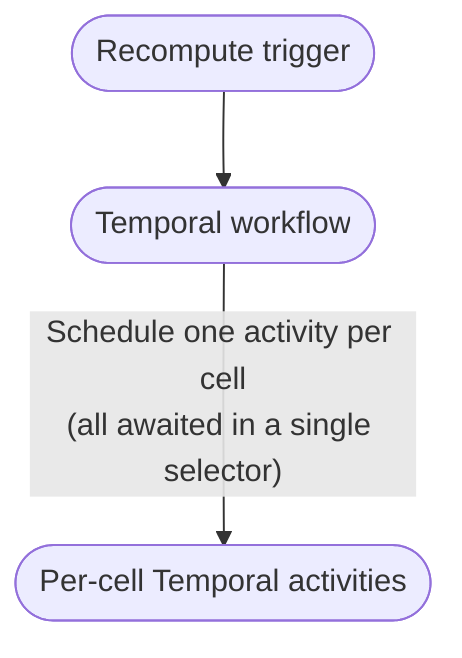
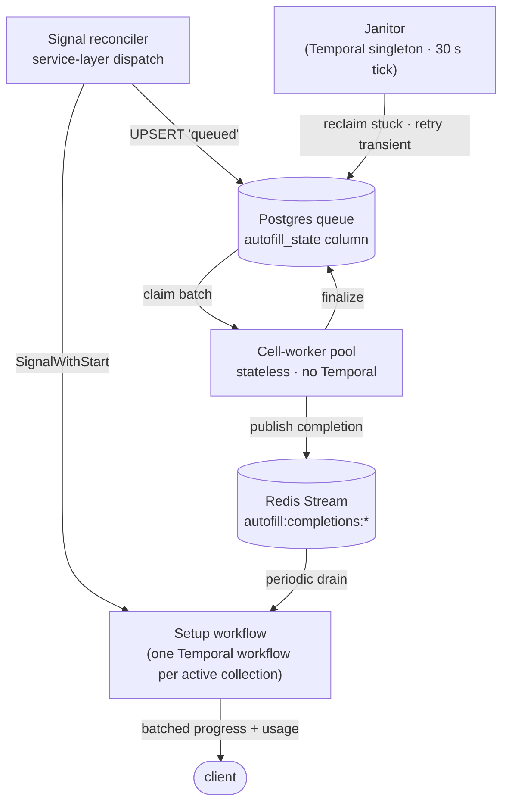
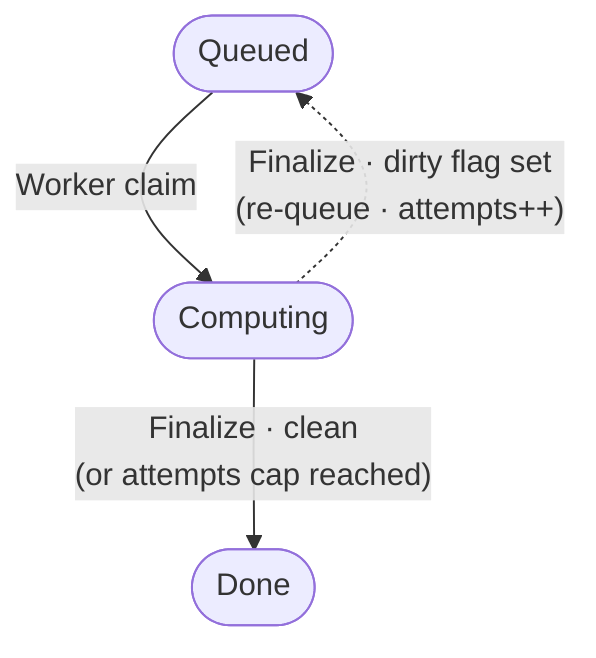

想像一張試算表，裡面任何一個儲存格都可以交給 AI 計算：A 欄是一個 URL，B 欄是根據這個 URL 產生的摘要，C 欄再根據摘要判斷情緒。你改了一個 URL，後面一小串相依的儲存格就要跟著重新計算。現在把這件事放大到一千萬個儲存格，而這時使用者剛剛按下了 _Reprocess column_。

這就是 **Collection Autofill** 背後真正要解的問題。它是 Instill AI 裡的一個功能，讓使用者可以定義 AI-computed cells，並由系統自動重新計算。這篇文章記錄的是我們如何讓這件事在大規模下仍然成立：產品要對使用者保證什麼、底層架構怎麼支撐這個保證、哪些設計選擇真正發揮作用，以及為什麼我們最後選擇了 Temporal、Postgres 和 Redis。

## 先談一下 Collections

先補一點產品背景。**Collections** 是 Instill AI 的核心介面，也是我們把非結構化資料變成 _structured context_ 的地方。輸入不一定只是靜態上傳的文件、圖片、影片或音訊，也可以是 **dynamic sources**：例如系統會定期抓取的網頁 URL、RSS feed，或是從其他系統同步進來的一列列資料。

每個輸入都會變成一列，而 AI-generated columns 則負責萃取、摘要、分類，或把每列資料轉成可以查詢的欄位。一個合約資料夾，可以變成能依交易對手、到期日和風險篩選的表格；一串競爭對手的 URL，可以變成網頁更新後會自動重新評分的市場監控表；一批會議錄音，可以變成能依主題和決策搜尋的資料表。一個混合檔案、連結和 live feeds 的研究資料集，最後可以變成下游 agents 能推理的 knowledge base。

換句話說，Collection 做的事，是把「一堆檔案和連結」變成「一個我真的可以發問的資料庫」。

這也是為什麼我們不把 Collection 看成「AI spreadsheet」而已。它背後其實有幾個更核心的產品和架構判斷：

- **Table 是跨來源工作的自然介面**：當資料來自很多地方，又需要比較、萃取、校正和追蹤狀態時，table 比 chat 或 search 更接近人真正工作的方式。
- **可信度要落在 schema 和 execution 裡**：如果某個欄位不能允許有 AI 幻覺，這件事不能只寫在 prompt 裡。欄位定義、欄位狀態和 UI 都要能表達「這裡沒有足夠證據」，而不是讓模型硬生出一個答案。
- **同一個 primitive 可以服務 extraction，也可以服務 generation**：做資料整理時，Collection 把分散的 context 收斂成可靠欄位；做內容生成時，同一組欄位和 DAG 則可以約束輸出的風格、角色和事實一致性。用途不同，但底層需要的是同一個 engine。
- **Knowledge work 會同時處理多種輸入與輸出 modality**：文件、圖片、影片、音訊、URL 和 feeds 都可能是輸入；輸出也不會永遠只有文字。Collection 要提供的是能承載這些 modality 的共同工作介面。

所以以產品概念來說，Collection 有四個核心設計重點：

- **Structured context**：把檔案、URL、live feeds、錄音等非結構化輸入，整理成可以查詢的欄位。
- **同時支援 static 和 dynamic sources**：資料可以是一次性上傳，也可以是會重新抓取、重新同步、需要重新計算的來源。
- **欄位相依性定義 workflow DAG**：AI-generated columns 可以依賴其他欄位，因此表格 schema 本身就定義了重新計算的 graph。
- **人類使用者和 AI agents 共用且可觀測**：使用者能檢視、修正、覆寫和追蹤狀態；agents 也能使用同一份 structured state 做推理和後續任務。這兩個視角不能拆成兩套各自為政的系統。

Autofill 則是負責填入這些 AI-computed cells 的引擎。無論輸入是靜態檔案，還是一個會持續更新的 live URL，它都要把原始 context 轉成產品裡可以使用的 structured context。也因為如此，它不能只在 demo 規模下跑得順暢，而是要在真實使用者丟進來的規模下，仍然快速、公平、可觀測。

而以執行系統來說，Autofill 的設計重點則是另一組：queue state 和 cell value 必須 transactionally consistent；orchestration 必須 durable 但 bounded；cell compute 必須 stateless and idempotent；大型 reprocess 不能卡住小型更新；重疊 recompute 必須收斂到最新結果；setup orchestration 和 cell computation 也必須能分開擴展。

## Autofill 要解的問題

Instill AI 裡的 Collection，本質上就是一張表格，但有一個關鍵差異：欄位不只是儲存資料，也可以定義計算。任何欄位都可以設定成 **AI-computed**，而 AI-computed columns 可以依賴其他欄位。這些欄位相依性，就是 Autofill 要執行的 workflow DAG。你修改 A 欄的 URL，B 欄的 AI 摘要就要重新計算；如果 C 欄的情緒判斷依賴 B 欄摘要，那一次 URL 修改就會一路展開成 A → B → C。乘上一萬列，schema-level DAG 就會變成大量 cell-level recomputation graph。

使用者期待的行為說起來很簡單，但實作起來其實不簡單。每個 AI cell 都有兩個值：使用者輸入的值，以及 AI 產生的值；顯示時永遠以使用者輸入為優先。系統還必須處理很多現實問題：同一個 collection 的大量 reprocess 不能卡住其他 collection；同一個 namespace 不能壟斷 worker pool；重疊的 recompute 不能讓舊結果覆蓋新結果；排程模式要支援 on change、never 和 cron；檔案輸入可能是非同步抵達；前端還需要即時進度更新。

這些加起來，才是真正的門檻。

## 為什麼只靠 Temporal 會撐不住

最自然的第一版設計，是把所有事情都交給 Temporal：每一列一個 workflow，每個 cell 一個 **activity**，然後在 workflow selector 裡等待所有 activities 完成。概念上非常乾淨：每個 scope 一個 workflow，每個 cell 一筆 activity record，整段流程都具備 durable execution。這也是熟悉 Temporal 的工程師很容易先做出來的版本。

在一百列的 demo 裡，這個設計運作得很好。但一旦超過 50,000 個 cells，問題就會開始疊加。

**1. Selector loop 會變成單執行緒瓶頸。** 每個 per-cell future 都在同一個 workflow selector 裡等待。Temporal 的 selector 很快，但它一次仍然只能處理一個 future。到一百萬個 cells 時，光是排程 overhead 就可能吃掉大約一百秒，而且這還發生在第一個 LLM token 回來之前。Workflow 看起來很忙，但使用者看不到任何有意義的進度。

**2. Temporal history 會隨 cells 線性成長。** 每個 per-cell activity 會寫入兩個 history events；一百萬個 cells 就是兩百萬個 events。這遠遠超過 Temporal 的 10,240-event soft warning，也很快會撞上 51,200-event hard cap，server 會直接終止 workflow。另外還有 50 MB total-history-blob limit。

**3. 沒有 per-collection fairness。** 如果 Collection A 開了一個很大的 bulk reprocess，它可以把整個 cluster 的 LLM queue slots 吃光。這時候使用者在 Collection B 改一個 cell，也可能要等到 A 跑完，有時甚至是幾個小時後。Dispatch loop 並不知道「這是另一個 collection，也應該被處理」。

**4. Setup 和 cell-compute 被綁在一起 deploy。** 兩者住在同一個 binary，但它們的變動節奏完全不同。Prompts 和 tool wrappers 可能一週改好幾次；workflow lifecycle，例如 shared-cache build 或 completion aggregation，可能一季才碰一次。只要綁在一起，每次 prompt change 都會變成 orchestration restart，順便打斷 in-flight cache leases 和 SSE streams。更麻煩的是，它們的擴展方式也不同：cell-compute 跟 LLM throughput 走，orchestration 跟 active collections 數量走。

前兩點的本質，是我們要求 Temporal 做了它不該做的工作。Temporal 很適合 bounded orchestration：需要 durable state、retries、signals 和可讀 history 的流程，非常適合它。**但 Temporal 不是 queue。** 當你開始寫 `for cell in 1..N { schedule activity }`，你其實是在 Temporal history 上面再搭一個 queue，最後會在 scheduling 和 storage 上都付出代價。

第三和第四點則不是 Temporal 的錯，而是把 cell-level scheduling 和 per-collection orchestration 混在同一層後，自然會出現的問題。

## 架構

把限制條件攤開後，答案其實蠻自然的。

- Cell-level work 是 **stateless and idempotent**。Worker 只要 claim 一個 cell、跑一次 LLM call、寫回結果。如果 worker 掛掉，另一個 worker 接手就好。這是 queue，不是 workflow。
- Per-collection orchestration **才是** workflow。建立 shared cache（DAG、credit check、namespace）、彙總 completions、送出 batched progress events、記錄 usage，這些都很適合 durable execution 和 bounded history。
- 兩者的 **deploy cadence 不同**，所以不應該綁在同一個 binary 裡。

所以最後 Collection Autofill 被拆成三個主要元件，再加上一個 singleton：

每個部分的責任很清楚：

- **Signal reconciler**：所有觸發入口都會經過的 service-layer dispatch。它會原子地把 cells 寫進 Postgres queue，並 signal per-collection workflow。
- **Setup workflow**：每個 active collection 正好一個 Temporal workflow。它負責 bounded orchestration：shared cache、completion aggregation、progress emission 和 usage recording。Idle 時會 Continue-As-New，所以 history 不會隨 cell count 線性長大。
- **Cell-worker pool**：stateless pods，沒有 Temporal client。每個 worker 透過 `SELECT FOR UPDATE SKIP LOCKED` 從 Postgres queue claim 下一個 work item。這個 Postgres pattern 讓多個 workers 可以同時搶 rows，被 lock 的 rows 會被跳過，而不是讓大家排隊卡住。Worker 跑完 LLM call 後，會用 compare-and-swap guard 寫回結果：只有在 claim 之後沒有人更新過這個 cell，才允許 commit。這樣即使某個慢 worker 被 reclaim，也不能覆蓋掉更新的結果。Completion events 則送到 Redis Stream，給 setup workflow 批次 drain。
- **Janitor**：Temporal singleton，每 30 秒 tick 一次，負責 reclaim stuck cells 和 retry transient failures。用 workflow ID 就能保證整個 cluster 只有一個 janitor，不需要另外做 per-pod leader election。

整體大致就是這樣。

## 三個最有用的設計選擇

上面的架構切法是比較明顯的一半。真正每天都在回本的，是下面這三個比較小的設計選擇。

### 把狀態欄位拆開，不要共用同一組欄位

Cell row 裡有 **兩個 state machines**，但它們住在不同欄位裡：

- **Cell-status state**（給使用者看的）：AI 答案是否 ready、是否 outdated、spinner 是否要顯示、錯誤是什麼、實際顯示值是什麼。這是 frontend 讀的狀態。
- **Queue state**（worker 內部使用）：`idle / queued / computing / done / error`、queued-at timestamp，以及用來處理 overlap 的 dirty flag。這是 worker pool 讀的狀態。

這兩者不共用欄位。只有三個 repository methods（upsert、claim、finalize）會同時碰到兩邊，而且每個方法都用一個 atomic SQL statement 完成，sync rules 也都包在裡面。

比較直覺的做法，常常會讓同一個欄位在不同 lifecycle point 代表不同意思。這類系統裡很多 race conditions 都藏在這種 overload 裡。把 state space 拆開，然後只透過少數 atomic methods 連接起來，可以直接消掉一整類 bug，而且不用改 frontend。使用者看到的行為不變，只是底層的實作更穩了。

如果要說有哪個決策是我一開始低估的，就是這個。

### 用 dirty flag，不要急著 cancellation

如果一個 cell 正在跑 LLM call，使用者又重新 reprocess 一次，該怎麼辦？直覺答案可能是：「取消目前這次 call，然後重跑。」但這個答案有兩個問題。第一，LLM tokens 已經花下去了，取消也不會退費；第二，能正確清理的 cancellation 往往很容易變成 bug 來源。

我們最後採用的是 dirty flag。當新的 signal 抵達一個正在 computing 的 cell 時，我們只記錄「有更新的 signal 進來了」，然後讓目前這次 LLM call 跑完。Finalize 的時候，worker 再檢查：如果這次 attempt 開始後有更新 signal，queue state 就回到 `queued`，而不是變成 terminal state。下一輪 claim 會再處理它，使用者最後會拿到最新的一次 recompute。這個 loop 也會 cap 在三輪，避免 pathological signal storm 無限燒錢。

Dirty flag 把問題從「取消已經過時的 work」，轉成「確保過時的結果不會被寫回」。對 LLM-backed cell computation 來說，這才是比較合理的保證：retries、reclaims 和 dirty requeues 都可能讓同一個 work 再跑一次，但使用者最後看到的 cell 會收斂到最新 signal，而 compare-and-swap guard 會防止舊 claim 覆蓋新結果。三個 states、三條 edges，就足夠表達整個 dirty-flag 機制；其他 cancel signals、janitor reclaim、transient retries，也都可以掛在同一個狀態模型上。

### 兩個 binaries，各自擴展

部署方式是這個設計裡成本最低、但回報很高的一部分。Setup orchestration 和 cell computation 被拆成兩個 binaries：一個有 Temporal client，一個沒有。原因很簡單，它們的角色、scaling characteristics 和 resource profiles 完全不同。

**setup-worker** binary 負責 per-collection setup workflow 和 cluster-wide janitor。它做的是協調工作：建立 shared cache（DAG、namespace、credit lookup）、drain Redis Stream completion bus、把 progress notifications 批次送給 frontend、記錄 token usage、reclaim stuck cells、retry transient failures。它的擴展方式主要跟 _active_ collections 數量有關，通常任一時刻就是幾十個，而不是跟 cells 數量成正比。

**cell-worker** binary 則是一個純 goroutine pool，預設每個 pod 二十個 goroutines，跑的就是 claim → LLM call → finalise loop。每個 goroutine 從 Postgres claim work，送 gRPC request 到 Python LLM worker，寫回結果，再 publish completion event。沒有 Temporal client、沒有 workflow registration、沒有 task-queue polling。只有 DB connection、LLM-worker gRPC client 和 Redis publisher。要更多 throughput，就加更多 pods 或 goroutines：十個 pods × 二十個 goroutines，就是兩百個 concurrent LLM calls。

這樣拆有四個好處。

**擴展軸可以分開。** Cell-workers 主要卡在 CPU、network 和 LLM calls，你會想要很多個；setup-workers 則是 IO-bound coordinators，一兩個 replicas 通常就夠。如果綁在一個 binary 裡，不是為了 LLM throughput 過度配置 Temporal pollers，就是為了 collection count 讓 cell-workers 不夠用。拆開後，每一側都可以依自己的 bottleneck 擴展。

**Failure isolation 比較乾淨。** Cell-worker 如果在 LLM call 中 crash，只會讓那個 pod claim 的 cells 留在 _Computing_，之後由 setup-worker 裡的 janitor reclaim。如果兩個責任住在同一個 process，一次 crash 會同時帶走 worker 和 recovery mechanism。

**Restart semantics 不同。** Setup-worker 倚賴 Temporal durable execution，workflow 可以透過 event replay 撐過 restarts。Cell-worker 則是 stateless and disposable：kill、restart、scale to zero 都可以，Postgres state machine 才是唯一重要的狀態。把這兩種模式混在同一個 binary，會讓 shutdown ordering 和 graceful drain 變複雜。

**Resource profiles 不同。** Cell-workers 需要很多 goroutines，setup-workers 則比較受 workflow replay history 和 concurrent workflow task ceiling 影響。兩者需要不同的 tuning、pod resource requests 和 HPA thresholds。如果塞在同一個 binary 裡，資源設定最後通常會被 scaling pressure 比較大的那一邊主導。

兩種 operational concerns，就應該是兩個 binaries。

## 為什麼是 Temporal、Postgres 和 Redis

合理的讀者應該會問：真的需要三種 infrastructure 嗎？不能用一個 workflow engine、一個 message bus，或一個 stream-processing framework 全部搞定嗎？我的答案是：這三層其實在解不同問題。

**Temporal 適合 orchestration tier**，因為 setup workflow 需要 durable state、signals 和 Continue-As-New。它要撐過 deploys、合併重疊 triggers、持有 5 分鐘 Redis cache lease，並在 collection active 的期間持續送出 batched progress ticks。這是 workflow，不是 job。像 _Airflow_ 這類 DAG scheduler 假設 batch runs 依照 calendar 發生；像 _Celery_ 這類 task queue 則沒有 first-class signals 或 durable workflow state。Temporal 很適合這一層，只是不適合拿來做 cell-level dispatch queue。

**Postgres 適合 queue tier**，最關鍵的原因是 queue state 和 cell value 必須 **transactionally consistent**。Worker finalize 一個 cell 時，「queue 說這個 work done」和「cell row 顯示 AI result」必須一起成功或一起失敗。用 Postgres，這就是一個 transaction；用 _Kafka_、_NATS_ 或 _SQS_ 這類獨立 queue product，會變成兩個 systems 之間的 distributed-commit problem，還需要額外 rate limiter 才能拿回 SQL window function 直接提供的 fairness。當 work items 本來就住在 relational database 裡，而且 retries 是 crash-safe 時，Postgres-as-queue 很難被打敗。

**Redis 適合 in-flight messaging bus**，因為需求剛好很小也很即時：給 setup workflow 的 completion envelopes、給 UI 的 progress frames、以及 workers 之間的 shared-cache invalidation markers。_Kafka_ 對這件事太重；_Pulsar_ 或 _NATS_ 又會多引入一個 stateful system，只為了省一點 latency。Redis 已經在 stack 裡負責 shared cache，讓它順手承載這個 bus，成本最低。

另外也值得回答一個資料工程背景的人常會問的問題：這是不是應該做成 _Flink_ 或 _Kafka Streams_ job？也就是 events in、events out。我的答案是否定的。這個 workload 是 bursty，不是 continuous streaming；cells 是獨立 transforms，沒有 windows 或 joins；而 stream processor 的 checkpoint 和 state backend overhead，對「claim 一列、finalize 一列」來說太重。Stream processors 很適合 real-time aggregations、multi-stream joins 和 time-windowed metrics，但不適合這種由 queue feeding 的 per-cell idempotent LLM transform。

做 greenfield design 時，很容易想找一個 shiny infrastructure 解決所有問題。但比較務實的做法，是承認這裡有三層不同需求：durable orchestration、transactional queue、transient messaging，然後讓每一層選適合自己的工具。

## 規模測試結果

為了確認 100K 到 10M cells 的設計目標，我加了一個小型 in-process benchmark，專注在 scheduling 和 state-machine layer。它會 allocate cell state、跑 concurrent claim/finalize workers、測量實際 CPU work，並依 component 建模 production CPU 和 memory/storage footprint。下面這次 run 使用 200 workers、16 collections、4 namespaces、每個 cell 兩個 Temporal events、每個 Temporal event 512 durable bytes、每個 cell operation 512 serialized payload bytes、每個 pool queue cell 192 row bytes 加上 96 index bytes，而且沒有 dirty requeues。

先講清楚：這不是在宣稱正式環境已經單次處理過一千萬個 live cells。它是一個用來檢查 scheduling/state-machine scaling 行為的 benchmark。

<figure id="figure-1">
  
  <figcaption>圖 1. 從 100K 到 10M cells 的 in-process scheduling/state-machine simulation。</figcaption>
</figure>

這張圖使用 log-log axes，所以對 **O(n)** workload 來說，接近直線是預期中的結果。真正有用的訊號是：在這個 simulation 裡，兩種設計都大致隨 cell count 線性成長，但 worker-pool 架構的 constant factor 比較低，也避開了 Temporal history events 持續膨脹的問題。對只用 Temporal 的設計來說，這個問題會在遠低於一千萬 cells 的規模時，就先成為實際運維上的瓶頸。

<figure id="figure-2">
  
  <figcaption>圖 2. 依 architecture 區分的 modeled CPU units。Units 是 benchmark hash-iteration equivalents，不是 CPU seconds。</figcaption>
</figure>

<figure id="figure-3">
  
  <figcaption>圖 3. 依 architecture 區分的 modeled production footprint，包含 app heap 和 durable orchestration 或 queue storage。</figcaption>
</figure>

|                                        | 最初的 Temporal-only 設計 | Collection Autofill                 |
| -------------------------------------- | ------------------------ | ----------------------------------- |
| 1M-cell simulator elapsed time         | ~ 3.41 s                 | ~ 1.41 s                            |
| 1M-cell simulator throughput           | ~ 293K cells/s           | ~ 708K cells/s                      |
| 1M modeled CPU units                   | ~ 1.19B                  | ~ 655M                              |
| 1M modeled app heap pressure           | ~ 153 MiB                | ~ 13.3 MiB                          |
| 1M modeled total footprint             | ~ 1.13 GiB               | ~ 293 MiB                           |
| Temporal history events                | 每次 run 約 2,000,000    | 每個 Continue-As-New window ≤ 10,000 |
| Per-cell Temporal activity records     | 每個 cell 一筆           | 零                                  |
| Per-collection fairness                | 無                       | Per-collection cap，由 SQL 強制     |
| Per-namespace in-flight fairness       | In-memory、single-process | 啟用 cap 時由 SQL 強制              |
| Backpressure observability             | 間接                     | 對 queue table 查一次 SQL           |
| Setup vs cell-compute deploy coupling  | 一個 binary              | 兩個 binaries，可獨立擴展           |

使用者看到的產品行為沒有改變。Reset、Reprocess、Schedule modes、undo/redo、spinner、progress hover，全都一樣。Frontend 不需要知道底下的這些東西存在。

## 下一個規模瓶頸在哪裡

目前這個架構的設計目標，是每個 collection 約 100K 到 10M cells 的範圍。在這個範圍內，bottleneck 會從 orchestration overhead 轉移到 LLM throughput、queue-claim contention 和 completion aggregation。

再往上擴一個數量級時，可能需要處理的問題其實也已經可以預見：超寬欄位可能需要 partitioned column workflows；某些 collection 可能需要 dedicated task queues；真正的 batch LLM inference 會變重要；per-cell version vectors 可以避免 upstream values 沒變時還重算；再更大規模時，cell table 也可能需要 hash partitioning。這些都已經寫下來了，但還不急。

重點不是現在就把所有東西做完，而是持續問同一個問題：到了下一個數量級，這個設計會先在哪裡出問題？

## 此次重構的心得

以下幾點是我希望自己能早點知道並且更重視的：

**把 Temporal 用在它擅長的地方。** 它很適合 bounded orchestration、durable state、retries、signals 和人類可讀 history，但不適合拿來承載數百萬個 events。當你開始寫 `for x in 1..N { schedule activity }`，你其實是在 workflow engine 上面建 queue，而且會一直為此付代價。

**Postgres 可以是一個很好的 queue。** 對 stateless、retry-safe 的 work 來說，`SELECT FOR UPDATE SKIP LOCKED` 加上 window-function fairness caps，可以直接在 SQL 裡提供 per-collection 和 per-namespace budgeting，而且 observable、queryable、indexed。這個能力從 Postgres 9.5 就存在，到今天仍然很實用。

**不要讓不同 state machines 共用同一組欄位。** 如果兩個 state machines 住在同一列，就給它們不同欄位，然後透過少數 atomic methods 連接。成本只是多幾個欄位；回報是大家不用再猜同一個 "started" timestamp 在不同流程裡到底代表什麼。

**Dirty flags 勝過 cancellation。** 為了更新的 signal 去取消昂貴的 in-flight calls（LLM、external APIs、大型 queries），通常只會浪費錢並增加 cleanup bugs。Dirty flag 加上便宜的 re-queue，反而能用更簡單的方式達到 latest-signal convergence。

**對稱的 API surfaces 比較耐用。** 當 cell、row、column，以及 single、batch 的各種組合，都能走同一個 dispatch primitive，之後新增新的維度就不會讓 dispatch logic 分叉。這也比較容易一次做對。

**兩個 binaries 不是 over-engineering。** Cell compute 和 orchestration 的壓力來源不同，擴展方式也不同。拆成兩個 binaries 之後，需要更多 LLM throughput 時，可以只擴 cell-worker；setup-worker 不需要一起重啟、重調 resource，也不會被迫跟著承擔同一組 scaling policy。

---

架構設計的核心，是先決定哪些限制不能妥協。Collection Autofill 選了三個：queue state 必須和 cell value transactionally consistent；orchestration 必須 durable 但 bounded；worker compute 必須 stateless and idempotent。三個限制條件、三層架構、三個工具：Temporal、Postgres、Redis。每一個都是因為它剛好適合那一層，而不是因為我們想用更多 infrastructure。

往一百億個 cells 前進。
